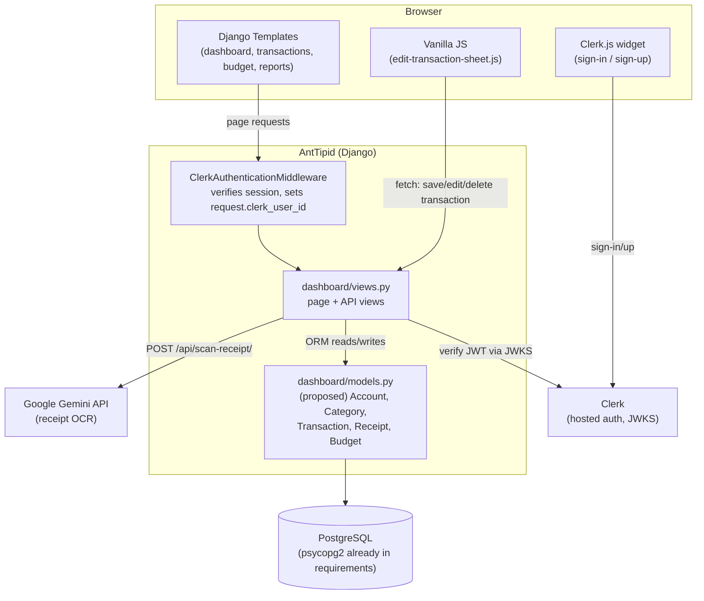
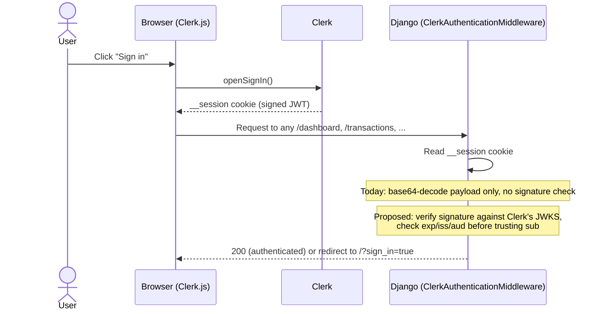
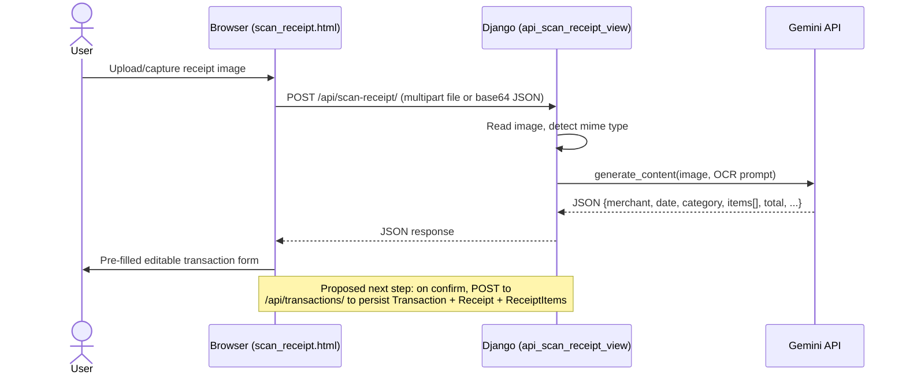
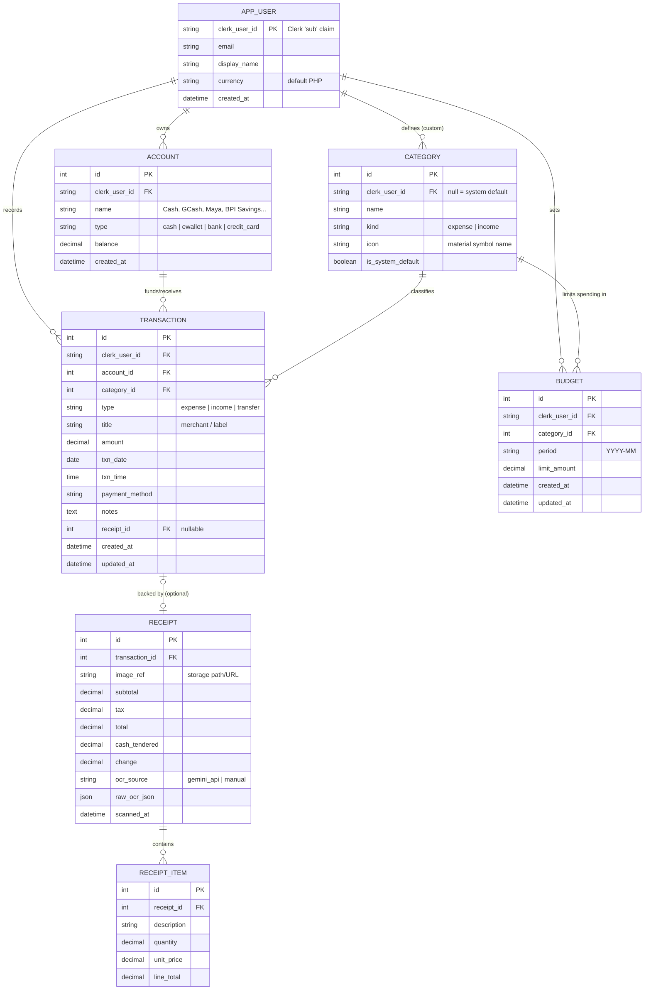
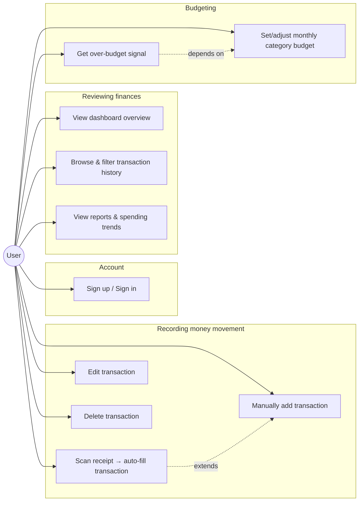

# AntTipid — Backend Documentation & Proposed Data Model

## 1. What AntTipid is

A personal finance tracker for individuals in the Philippines (₱ PHP): balance overview, monthly category budgets, AI receipt scanning, and spending reports. See `PRODUCT.md` for brand/product framing.

## 2. Current implementation snapshot

The repo today is a **Django template frontend with one real backend feature**. Everything else visible in the UI (transactions, budgets, reports, dashboard totals) is hardcoded markup/mock data, not data read from a database.

| Layer | State | Evidence |
|---|---|---|
| Data models | **None** | `dashboard/models.py` and `dashboard/admin.py` are stubs; no app-level tables exist beyond Django's built-in auth/session tables in `db.sqlite3` |
| Transactions, budgets, reports | **Placeholder UI** | `transactions.html`, `budget.html`, `reports.html`, `index.html` render fixed numbers/rows directly in the template (e.g. `data-spent="2400" data-target="3000"`, hardcoded `₱124,500.00` balance) |
| Edit transaction sheet | **UI stub, no persistence** | `static/js/edit-transaction-sheet.js` opens/closes a sheet and shows a success toast on save, but never sends data anywhere |
| Receipt OCR | **Real, working** | `POST /api/scan-receipt/` (`dashboard/views.py:api_scan_receipt_view`) uploads an image to Gemini (`gemini-3.6-flash`) and returns structured JSON — the one genuine backend integration |
| Auth | **Client-side widget + unverified session read** | Clerk's JS SDK handles sign-in/sign-up in `landing.html`; `dashboard/middleware.py` (`ClerkAuthenticationMiddleware`) reads the `__session` cookie and **base64-decodes the JWT payload without verifying its signature** — treat this as a placeholder, not a security boundary |
| Database | SQLite, unused by the app | `AntTipid/settings.py` points at `db.sqlite3`; `psycopg2-binary` is already in `requirements.txt`, implying Postgres is the intended production target |

**Categories in use** (from the Gemini OCR prompt in `views.py`): `Groceries, Dining, Transportation, Utilities, Shopping, Healthcare, Entertainment, Services, Other`.
**Note:** `budget.html` uses a slightly different, hand-typed set (`Food & Dining`, `Transportation`, `Utilities`, `Entertainment`) — this drift is exactly the kind of thing a real `Category` table fixes.

**Payment methods in use:** `Cash, GCash, Maya, Credit Card, Debit Card, Bank Transfer`.
**Transaction types in use:** `expense, income, transfer` (see `edit-transaction-sheet.js: TYPE_DISPLAY`).

## 3. Proposed architecture

The frontend and the OCR integration stay as-is. What's missing is a persistence + API layer between them.

## 4. Auth flow (current + hardening needed)

## 5. Receipt scan flow (already implemented)

## 6. Entity-Relationship Diagram (proposed)

Scoped to what the existing UI and OCR schema already need — no speculative entities (no tags, recurring rules, multi-currency, or shared/family accounts, since nothing in the product today calls for them).

Notes on the design:
- `AppUser` has no local password/identity fields — Clerk is the identity source of truth; the row exists to hang `Account`/`Transaction`/`Budget` off a stable local key and cache profile fields.
- `Category` supports both system defaults (`clerk_user_id IS NULL`, seeded from the 9 OCR categories) and per-user custom categories (the budget page's "New Category" button), which also resolves the `Groceries/Dining` vs `Food & Dining` naming drift by making category names a single canonical table instead of copy-pasted strings.
- `Receipt`/`ReceiptItem` are optional and only exist for OCR-originated transactions; manually-added transactions (`add_transaction.html`) have no receipt row.
- `Budget.period` is monthly (`YYYY-MM`) per-category, matching `budget.html`'s per-category monthly limit UI.

## 7. Use cases

| # | Use case | Actor | Preconditions | Main flow | Backed by |
|---|---|---|---|---|---|
| UC1 | Sign up / Sign in | Visitor | — | Click sign-in → Clerk hosted widget → session cookie set → redirected to `/dashboard/` | Clerk (existing) |
| UC2 | Scan receipt | User | Signed in | Upload/capture image → `POST /api/scan-receipt/` → Gemini returns itemized JSON → user reviews/edits in `scan_receipt.html` → confirms | Gemini (existing) + **new** `POST /api/transactions/` to persist `Transaction` + `Receipt` + `ReceiptItem` rows |
| UC3 | Manually add transaction | User | Signed in | Fill `add_transaction.html` form (type, amount, category, account, date, notes) → submit | **New** `POST /api/transactions/` |
| UC4 | Edit transaction | User | Transaction exists | Open edit sheet (already wired in `edit-transaction-sheet.js`) → change fields → Save | **New** `PATCH /api/transactions/{id}/` — sheet already calls `onSaveCallback`, just needs a real fetch instead of a toast-only stub |
| UC5 | Delete transaction | User | Transaction exists | Long-press/tap delete on `transactions.html` row → confirm | **New** `DELETE /api/transactions/{id}/` |
| UC6 | View dashboard overview | User | Signed in | Load `/dashboard/` → balance, recent transactions, budget progress render from real data instead of the current fixed `₱124,500.00` | **New** `GET /api/dashboard/summary/` |
| UC7 | Browse/filter transaction history | User | Signed in | Load `/transactions/` → filter by date range/category/account | **New** `GET /api/transactions/?category=&account=&from=&to=` |
| UC8 | View reports & trends | User | Has transactions | Load `/reports/` → income vs. expense chart, top categories | **New** `GET /api/reports/monthly/?period=YYYY-MM` (aggregation, no new tables) |
| UC9 | Set/adjust category budget | User | Signed in | `budget.html` → click category card → set monthly limit → save | **New** `POST/PATCH /api/budgets/` |
| UC10 | Over-budget signal | User | Budget set for category | System compares `SUM(Transaction.amount)` for category+period against `Budget.limit_amount`; UI already has the "Over Budget" badge, just needs a real comparison instead of the hardcoded `1 Category` count | Derived from `Transaction` + `Budget`, no new table |

## 8. API surface

| Endpoint | Method | Status | Purpose |
|---|---|---|---|
| `/` | GET | Existing | Landing page |
| `/dashboard/` | GET | Existing (placeholder data) | Dashboard shell |
| `/transactions/` | GET | Existing (placeholder data) | Transaction history page |
| `/budget/` | GET | Existing (placeholder data) | Budget page |
| `/reports/` | GET | Existing (placeholder data) | Reports page |
| `/add/` | GET | Existing (no submit handler) | Manual transaction form |
| `/scan-receipt/` | GET | Existing | Receipt scanner UI |
| `/api/scan-receipt/` | POST | **Existing, real** | Gemini OCR on an uploaded receipt image |
| `/api/transactions/` | GET, POST | Proposed | List/filter, create transactions |
| `/api/transactions/{id}/` | PATCH, DELETE | Proposed | Edit/delete a transaction |
| `/api/budgets/` | GET, POST | Proposed | List/set category budgets for a period |
| `/api/budgets/{id}/` | PATCH | Proposed | Adjust a budget limit |
| `/api/dashboard/summary/` | GET | Proposed | Balance, this-month totals, recent transactions, budget progress |
| `/api/reports/monthly/` | GET | Proposed | Income vs. expense series, top categories for a period |

## 9. Known gaps to close before this is a real backend

1. **JWT verification** — `ClerkAuthenticationMiddleware` trusts an unverified, base64-decoded payload. Must verify against Clerk's JWKS (signature, `exp`, `iss`, `aud`) before trusting `clerk_user_id`.
2. **No persistence** — every number on every page is currently hand-typed HTML/`data-*` attributes. Section 6/8 above is the fix.
3. **Category naming drift** — `views.py`'s Gemini prompt and `budget.html`'s hardcoded cards use different category label sets; a single `Category` table (seeded once) removes the duplication.
4. **Receipt image storage** — `api_scan_receipt_view` currently discards the uploaded image after sending it to Gemini; if OCR-derived transactions should show the original receipt later, image bytes need to land in object storage (or a `media/` volume) referenced by `Receipt.image_ref`.
5. **Production DB** — `psycopg2-binary` is already a dependency; `DATABASES` in `AntTipid/settings.py` still points at SQLite only.
